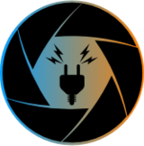

# ```Be</plug>```
_____

## Fonctionnalités (sections)
  * home = summaries (notification, calendar, links, forums)
  * notifications
  * calendar
  * links
  * forums
  * chatbox
  * privateMsgs
  * usersON

_____

| Server   | Client    |
| ---      | ---       |
| Backtick | `         |
| Pipe     | \|        |
_____

## Problèmes rencontrés / découvertes
* prob de co après manip json => parce que nodemon redémarre
* readFile (non bloquant) / readFileSync (bloquant)
* récupérer le pseudo pour la déconnexion => need sessions
